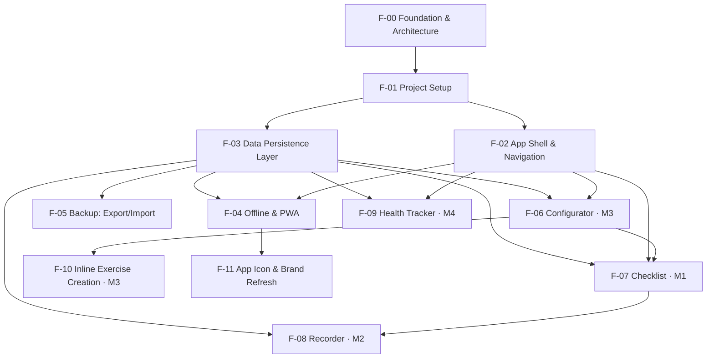

# Recomp Tracker — Feature Specifications

An offline-first, client-only single-page application to **run and track a body‑recomposition
training program during workout sessions**. Everything (workouts, session history, and InBody
health reports) is stored on-device in **IndexedDB**. No backend, no account, no network
dependency at runtime.

This directory (`features/`) is the planning "funnel": one independent specification file per
part of the application. Read them in the build order below.

---

## 1. Conventions

### 1.1 Spec identifiers

Every spec has a stable ID `F-NN`. Requirements and acceptance criteria are numbered per spec so
they can be referenced unambiguously from code reviews, commits, and other specs.

| Prefix | Meaning | Example |
| --- | --- | --- |
| `F-NN` | Feature / spec ID | `F-06` |
| `FR-NN.x` | Functional requirement | `FR-06.3` |
| `AC-NN.x` | Acceptance criterion | `AC-06.3` |
| `OQ-NN.x` | Open question | `OQ-06.1` |

### 1.2 Status values

`Draft` → `Reviewed` → `Approved` → `Implemented`. All specs start at **Draft**.

### 1.3 Uniform template

Every feature file follows the **same section order**:

1. Title / ID (+ status header block)
2. Summary
3. Goals / Non-goals
4. User stories
5. Functional requirements (numbered)
6. Data model (IndexedDB stores/indexes touched)
7. UI / UX notes (layout, density)
8. Dependencies (other feature specs)
9. Acceptance criteria (checklist)
10. Open questions

> The **canonical, full data model** (entity shapes, store definitions, indexes) lives in
> [`F-00 Foundation & Architecture`](./00-foundation-architecture.md). Every other spec references
> it and only lists the stores/indexes it touches.

---

## 2. Spec index

| ID | Spec | Module | Status |
| --- | --- | --- | --- |
| F-00 | [Foundation & Architecture](./00-foundation-architecture.md) | Cross-cutting | Implemented |
| F-01 | [Project Setup & Tooling](./01-project-setup.md) | Cross-cutting | Implemented |
| F-02 | [Application Shell & Navigation](./02-app-shell-and-navigation.md) | Cross-cutting | Implemented |
| F-03 | [Data Persistence Layer](./03-data-persistence-layer.md) | Cross-cutting | Implemented |
| F-04 | [Offline & PWA](./04-offline-and-pwa.md) | Cross-cutting | Implemented |
| F-05 | [Data Backup: Export & Import](./05-data-backup-export-import.md) | Cross-cutting | Implemented |
| F-06 | [Workout Configurator](./06-workout-configurator.md) | Module 3 | Implemented |
| F-07 | [Workout Checklist](./07-workout-checklist.md) | Module 1 | Implemented |
| F-08 | [Workout Recorder](./08-workout-recorder.md) | Module 2 | Implemented |
| F-09 | [Health Tracker (InBody)](./09-health-tracker.md) | Module 4 | Implemented |
| F-10 | [Inline Exercise Creation During Routine Building](./10-inline-exercise-creation.md) | Module 3 | Implemented |
| F-11 | [App Icon & Brand Identity Refresh](./11-app-icon-brand-refresh.md) | Cross-cutting | Draft |

---

## 3. Build order & dependency graph

Recommended implementation order: **F-00 → F-01 → F-02 → F-03 → F-04 → F-05 → F-06 → F-07 →
F-08 → F-09**. The Configurator (F-06) is built before the Checklist (F-07) because the checklist
consumes the workout definitions the configurator produces; the Recorder (F-08) is built after the
checklist because completed sessions originate there. **F-10** and **F-11** are later, independent
enhancements layered on top of the already-implemented F-06 and F-04 respectively — they don't block
or get blocked by F-07/F-08/F-09.

---

## 4. Shared data model (summary)

IndexedDB is accessed through **Dexie.js**. Full definitions are in F-00; this is the map.

| Store | Primary key | Purpose | Owning spec |
| --- | --- | --- | --- |
| `exercises` | `id` | Reusable exercise/activity library | F-06 |
| `routines` | `id` | Named workout-day templates (ordered exercise items) | F-06 |
| `schedule` | `weekday` | Weekday → routine assignment (weekly microcycle) | F-06 |
| `sessionLogs` | `id` | Completed/partial session records (calendar) | F-08 |
| `activeSession` | `id` | The single in-progress session (same-day; expires at midnight) | F-07 |
| `healthReports` | `id` | Editable, dated InBody body-composition reports | F-09 |
| `meta` | `key` | Settings, user profile & app metadata (theme, density, week-start, schema version…) | F-03 |

---

## 5. Tech stack (target)

| Concern | Choice |
| --- | --- |
| Language | TypeScript |
| UI framework | Svelte |
| Build tool / dev server | Vite |
| Persistence | IndexedDB via Dexie.js |
| Routing | Hash-based SPA router (`svelte-spa-router`) |
| PWA / service worker | `vite-plugin-pwa` (Workbox) |
| Styling | Plain CSS + design tokens (CSS custom properties); mobile-first |
| Testing | Vitest (unit/component); Playwright (E2E) deferred beyond v1 — see F-01 |

---

## 6. Global non-goals (v1)

- No server, cloud sync, authentication, or multi-user support.
- No wearable / heart-rate device integration (HR is entered manually).
- No nutrition/calorie logging (the diet plan in `research.md` is reference only).
- No social, sharing, or notification/reminder features.
- No automatic program generation — workouts are configured manually; an example program loads only via an explicit opt-in (F-06).

---

## 7. Glossary

| Term | Definition |
| --- | --- |
| **Exercise** | A reusable activity definition (e.g. "Barbell Back Squat"), either *sets/reps* or *duration* based. |
| **Routine** | A named workout day (e.g. "Lower Body A") = an ordered list of exercises with prescriptions. |
| **Schedule** | Mapping of each weekday to zero or more routines (the weekly microcycle). |
| **Prescription** | The planned target for an exercise inside a routine (sets/reps/load *or* duration/intensity). |
| **Session** | A single instance of performing a routine on a date. In-progress = `activeSession`; finished = `sessionLog`. |
| **Health Report** | A dated, editable record of InBody body-composition measurements. |
| **Density** | UI information density. Default **medium** (compact but touch-friendly, ≥44px targets). |
